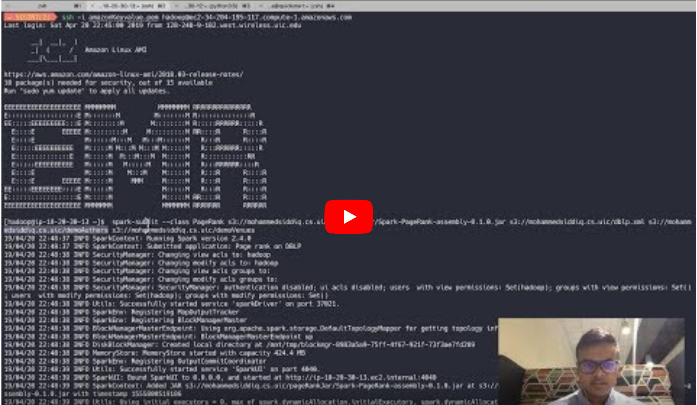

#OVERVIEW

Page rank implementation on the authors and venues graph generated from the DBLP dataset using SPARK.

##Description

- [DBLP dataset](https://dblp.uni-trier.de/) (represented in XML format) describes the publications, authors and the venues of the publication.
- This file is hosted on HDFS and logical splits of each publication is done using the custom implementation of [XMLInputFormat]().
- RDD is constructed using this file on HDFS.
- The Following operations are performed on each logical input/entry of the dataset
    - Authors and venues are extracted.
    - Node links are generated between the co-authors and the venues (bi-directional graph is considered).
    - Every link in the graph is given am initial probability (Initial page rank).
    - These links are cached since page rank runs on the basis of these links and every worker/task needs access to it.
- Page rank is applied iteratively over the nodes/links in the graph. The damping/teleportation factor is considered to be 0.15. [Refer to this link for more details on page rank in the spark ](https://community.hortonworks.com/idea/102753/tutorial-101-pagerank-example-in-spark-20-understa.html)
- After the algorithm stabilizes the page rank values, the ranked nodes are sorted based on the page rank values.
- The authors and venues are filtered out accordingly based on their ranks.

The following is an example output for the UIC authors in the DBLP dataset.

Authors page rank
-

```
    (Philip S. Yu,72.17358923786207)
    
    (Bing Liu,39.06762535082672)
    
    (Ouri Wolfson,28.496776227313035)
    
    (Isabel F. Cruz,28.395424558956968)
    
    (Barbara Di Eugenio,20.618331944971104)
    
    (A. Prasad Sistla,20.021441901636937)
    
    (Ajay D. Kshemkalyani,19.832975812113258)
    
    (Bhaskar DasGupta,19.44857424762532)
    
    (Robert H. Sloan,16.733228284339656)
    
    (Lenore D. Zuck,15.596224206984767)
    
    (Xinhua Zhang,14.843940965618545)
    
    (Mark Grechanik,14.731149359854117)
    
    (Daniel J. Bernstein,12.705867944366114)
    
    (Cornelia Caragea,12.6482246855889)
    
    (Peter C. Nelson,10.89272817193666)
    
    (Brian D. Ziebart,10.650371634945353)
    
    (Piotr J. Gmytrasiewicz,10.12146523274226)
    
    .........
```
   
     
Venues page rank
-


```
(CoRR,7.283664532969762)

(IJCAI,2.8915321964265495)

(AAAI,2.6691634919771645)

(SIGCSE,2.2561828226006035)

(ACM Conference on Computer and Communications Security,1.9034485726778618)

(ASONAM,1.882170704298203)

(Inf. Process. Lett.,1.8467006238980814)

(SODA,1.839465802997625)

(CollaborateCom,1.730722037091281)

(WWW,1.7196391848658394)

(IEEE Trans. Knowl. Data Eng.,1.7156789486724864)

(SIGMOD Conference,1.6921312263189152)

(IEEE Trans. Parallel Distrib. Syst.,1.6516080153109864)

(J. Parallel Distrib. Comput.,1.6504236768509981)

(NIPS,1.6194651975382972)

(Theor. Comput. Sci.,1.6130057198222363)

(J. Comput. Syst. Sci.,1.6056537767001755)

(COLT,1.5857082534384472)

(INFOCOM,1.5068868882251152)

(IEEE Internet Computing,1.476026270184349)
.
.
.
.
.
``` 
    
## Steps to Run 

Build the jar using

````
sbt clean assembly
````

This will run all the test cases and if they pass (which they will) builds a fat jar.

Run the following command to run the spark job in the `local mode` 

```
spark-submit --class PageRank \
--master local --deploy-mode client --executor-memory 1g \
--name sampleRun --conf "spark.app.id=sampleRun" \
Spark-PageRank-assembly-0.1.0.jar hdfs://192.168.151.156:8020/user/cloudera/input/dblp.xml hdfs://192.168.151.156:8020/user/cloudera/rankedAuthors hdfs://192.168.151.156:8020/user/cloudera/rankedVenues

```
where `hdfs://192.168.151.156:8020/user/cloudera/input/dblp.xml` is the input path containing the dblp file. Replace with your HDFS path.

and `hdfs://192.168.151.156:8020/user/cloudera/rankedAuthors` `hdfs://192.168.151.156:8020/user/cloudera/rankedVenues`  are output paths for the authors and venues respectively.


Command to run on the amazon EMR :

```

 spark-submit --class PageRank s3://mohammedsiddiq.cs.uic/pageRankJar/Spark-PageRank-assembly-0.1.0.jar s3://mohammedsiddiq.cs.uic/dblp.xml s3://mohammedsiddiq.cs.uic/latestauthorsranked s3://mohammedsiddiq.cs.uic/latestvenuesranked

```

[](https://youtu.be/OetsAniwOVM "Demo of the project" )
